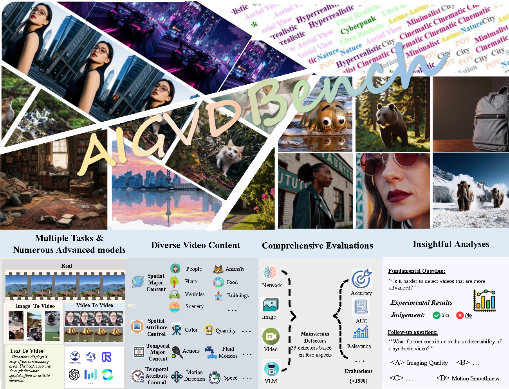

# AIGVDBench: Comprehensive Benchmark for AI-Generated Video Detection

---

## 📖 Overview

AIGVDBench is a large-scale, high-quality benchmark for AI-generated video detection, designed to address key limitations in dataset scale and model diversity. This benchmark comprises over 440,000 videos from 31 generation models, covering text-to-video (T2V), image-to-video (I2V), video-to-video (V2V), and real-world scenarios.

**Key Contributions:**
- 🎯 Standardized benchmark construction pipeline ensuring representativeness and reproducibility  
- 📊 High-quality benchmark with 422K+ videos from diverse generation models  
- 🔬 Systematic evaluation of 33 detectors across 4 categories with 8 in-depth analyses  
- 💡 Identification of 4 novel findings for future research directions  

---

## 🚀 Key Features

### Dataset Scale and Diversity

AIGVDBench significantly surpasses existing datasets in scale, content diversity, coverage of generation tasks, and variety of video generation models. It comprises videos generated by **31 distinct models** (**20 open-source** and **11 closed-source**), spanning **23 T2V**, **6 I2V**, and **2 V2V** generation models.

| Dataset | Publication | Latest Models | Methods | Open Source | Closed Source | T2V | I2V | V2V | Real World | Generated Videos | Content Diversity |
|---------|------------|---------------|---------|-------------|---------------|-----|-----|-----|------------|-----------------|-----------------|
| GVD | PRCV'24 | Sora (2024.2) | 11 | 3 | 8 | 8 | 3 | - | ✅ | 11.6k | ❌ |
| GVF | ICME'25 | Kling (2024.6) | 9 | 4 | 5 | 9 | - | - | ✅ | 4.2k | ❌ |
| GenVideo | ArXiv'24 | OpenSora (2024.3) | 20 | 14 | 6 | 16 | 4 | - | - | 100k | ❌ |
| GenVidBench | ArXiv'25 | Mora (2024.3) | 8 | 7 | 1 | 6 | 2 | - | - | 109.2k | ❌ |
| GenBuster-200K | ArXiv'25 | EasyAnimate (2025.1) | 12 | 4 | 8 | 8 | - | - | - | 101.1k | ❌ |
| GenWorld | ArXiv'25 | Cosmos (2025.1) | 10 | 10 | - | 7 | 2 | 1 | - | 89.4k | ❌ |
| **Ours (AIGVDBench)** | - | Open-Sora (2025.3) | **31** | **20** | **11** | **23** | **6** | **2** | ✅ | **422k** | ✅ |

**Table Notes:**
- **Latest Models:** Year when the latest video generation model was added  
- **Methods:** Number of video generation models used  
- **Model Type:** Open-source vs closed-source  
- **Generation Tasks:** T2V / I2V / V2V  
- **Generated Videos:** Number of generated videos  
- **Real World:** Includes real-user scenario videos  
- **Content Diversity:** ✅ = automated / balanced, ❌ = manual / not balanced  

---

## 📊 Dataset Details

**Included Generation Models**
- **Open-Source (20):** Open-Sora, RepVideo, AccVideo, CogVideoX, EasyAnimate, Wan2.1, VideoCrafter, Pyramid-Flow, IPOC, Hunyuan, and more  
- **Closed-Source (11):** Sora, Kling, Gen2, Gen3, and more  

**Data Statistics**

| Category | Open-Source Models | Closed-Source Models |
|----------|------------------|--------------------|
| Training Videos | 14,000 per model | - |
| Test Videos | 3,000 per model | 2,000 per model |
| Real Videos | 14,000 | 2,000 per model |

---

## 📈 Benchmark Results

**Detector Categories Evaluated:**
- **Video Classification Models:** MViTv2, UniFormer, VideoSwin, VideoMAE, TSM, SlowFast, TimeSformer, and more  
- **AI-Generated Image Detection Models:** NPR, FreDect, Fusing, Gram-Net, CNNSpot, D3, and more  
- **AI-Generated Video Detection Models:** DeMamba, DeCoF  
- **Vision-Language Models:** Emu3-Stage1, FastVLM, DeepseekVL, LLaVA, Kimi-VL, and more  

---

## 🔬 In-Depth Analysis

- **Open vs. Closed Source Model Detectability:** Closed-source models are harder to detect  
- **Generation Task Impact:** Detection varies across T2V, I2V, V2V; V2V is most challenging  

> For more detailed analysis, please refer to our [paper](https://huggingface.co/datasets/AIGVDBench/AIGVDBench/tree/main)

---

## 📊 Data Access

The AIGVDBench dataset is publicly available:

- 🤗 [Hugging Face Datasets](https://huggingface.co/datasets/AIGVDBench/AIGVDBench)  
- ☁️ [Quark Cloud Drive](https://pan.quark.cn/s/b9d0548b310c)

---

## 📜 Citation

---

## 🙏 Acknowledgments

We would like to express our **deepest gratitude** to **OpenVid-HD** for generously allowing us to open-source real-world video sources. Their support has been **instrumental** in making AIGVDBench possible, and we are truly appreciative of their willingness to share such valuable resources with the community.

We also thank the following for their contributions and inspiration:  
- **VBench evaluation framework** for guiding our benchmarking methodology  
- All **open-source video generation model communities** for making their models publicly available and fostering progress in the field  

Their support and collaboration have been crucial in building a **reliable and reproducible benchmark** for AI-generated video detection.

